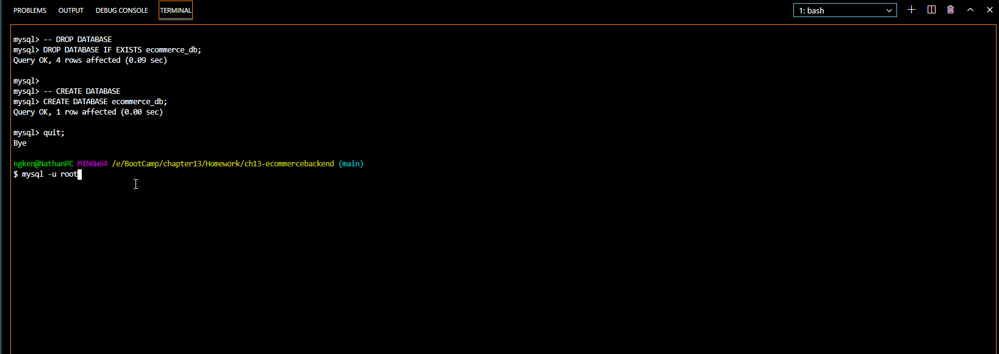

# ch13-ecommercebackend

## Table of Contents

* [Description](#description)
* [Usage](#usage)
* [Credit](#credit)
* [Criteria](#criteria)
* [Questions](#questions)

## Description
This project is the backend for an e-commerce site. You can submit a GET, POST, PUT, and DELETE for categories, products, and tags. The tags and products have a many-to-many relationship, since a product can have multiple tags and vice versa. My motivation for creating this is to gain experience in the largest sector of the electronics industry. Being able to code the backend for a project in a $29 trillion indusry is a valuable skill to have as a full-stack web developer.

```md
AS A manager at an internet retail company
I WANT a back end for my e-commerce website that uses the latest technologies
SO THAT my company can compete with other e-commerce companies

```

## Usage

To access the repo, go to https://github.com/ngkent75/ch13-ecommercebackend

To access on Heroku, go to https://serene-hollows-45241.herokuapp.com

Make sure to put the correct API route at the end.

The following GIFs will walk you through how to initialize the server and database and how to utilize GET, POST, PUT, and DELETE through PostMan.

1. Generate the schema using MySQL.



2. Make sure you have already run npm i if you don't have a package-lock.json. Type in the command `npm run seed` into the terminal to run the seed files.


3. Type in the command `npm start` to start the server.


Pay attention to the port that the server is running on.


4. Open up PostMan and make sure you are on http://localhost:3001. Here is how to GET all categories, products, and tags. Make sure you have GET selected and you have the route typed in.


5. You can specify which category, product, and tag to GET by inserting the ID at the end of the URL.


6. You can create another category, product, or tag using POST. Make sure POST is selected, and insert the information as a JSON.


7. PUT allows you to update existing categories, products, and tags. You need to include the ID the same way it was included in the GET singles from step 5. Make sure PUT is selected.


8. If you would like to delete a category, product, or tag, make sure DELETE is selected and that you specified the ID.


9. To shut off the server, press ctrl + c (on Windows) in the terminal.

## Credit

Markdown documentation: https://guides.github.com/features/mastering-markdown/#syntax

Recording software: https://www.cockos.com/licecap/

dotenv: https://www.npmjs.com/package/dotenv

express: https://www.npmjs.com/package/express

mysql2: https://www.npmjs.com/package/mysql2

sequelize: https://www.npmjs.com/package/sequelize

nodemon: https://www.npmjs.com/package/nodemon

PostMan: https://www.postman.com/

MySQL: https://www.mysql.com/

## Criteria

```md
GIVEN a functional Express.js API
WHEN I add my database name, MySQL username, and MySQL password to an environment variable file
THEN I am able to connect to a database using Sequelize
WHEN I enter schema and seed commands
THEN a development database is created and is seeded with test data
WHEN I enter the command to invoke the application
THEN my server is started and the Sequelize models are synced to the MySQL database
WHEN I open API GET routes in PostMan for categories, products, or tags
THEN the data for each of these routes is displayed in a formatted JSON
WHEN I test API POST, PUT, and DELETE routes in PostMan
THEN I am able to successfully create, update, and delete data in my database

```


## Questions
Have any questions? Feel free to reach out.

GitHub: [ngkent75](https://github.com/ngkent75)

Email: [ngkent75@gmail.com](mailto:ngkent75@gmail.com)